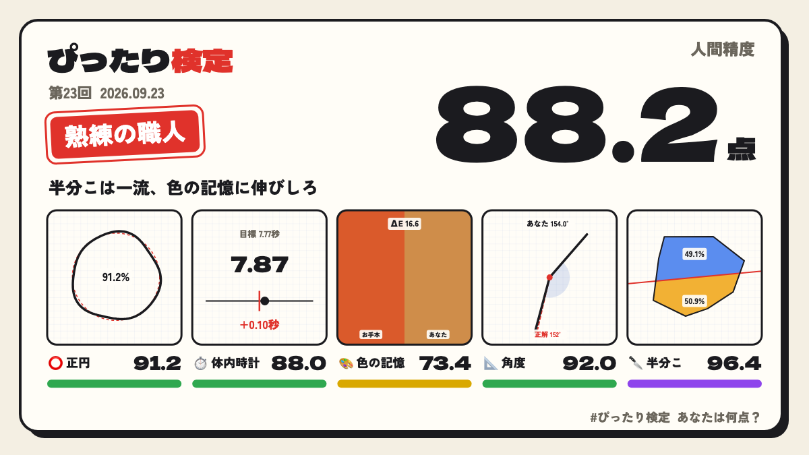

# ぴったり検定 — あなたの“人間精度”は何点？

> 依頼: X（旧Twitter）で一番バズるゲームを、テーマ選定から自分で考えて作る。ブラウザで遊べる形にし、なぜバズると考えたかと遊び方をこの文書に書く。

## 一言でいうと

**「正円」「体内時計」「色の記憶」「角度」「半分こ」の5つの“ちょうど”を60秒で測り、あなたの「人間精度」を100点満点で採点する日替わり検定。** 本番の問題は日本時間の日付ごとに全員共通で、結果は「点数・称号・絵文字グリッド・5枚の証拠画像」になって X に流せる。

エントリポイント: `index.html`（外部依存は Google Fonts だけ。フォントが読めなくても代替フォントで遊べる）

---

## なぜ X でバズると考えたか

### 1. すでにバズった形式を5つ束ねた

X でバズった実績のある「精度チャレンジ」を、1本の短いセッションにまとめた。

| 過去の流行 | このゲームでの形 |
|---|---|
| neal.fun「Draw a perfect circle」（正円を描いて%で採点） | 第1問 正円 |
| 「10秒ぴったりで止めろ」系のストップウォッチ | 第2問 体内時計（目標秒数は日替わり、1.5秒後に表示が消える） |
| 「dialed」系の色を記憶して再現するゲーム | 第3問 色の記憶（3秒だけ見て、HSVピッカーで再現） |
| 分度器なしで角度を当てる／図形を半分に切るお題 | 第4問 角度、第5問 半分こ（一発勝負のスワイプ） |

1問だけだと飽きられるが、5問なら得意と苦手がばらけるので、同じ人でも毎回結果が変わる。

### 2. Wordle 型の「全員同じ問題」と「絵文字グリッド」

- 本番は **1日1回で、問題は全員共通**（日付をシードにした乱数で生成）。「今日の半分こ、形がえぐい」「今日の7.77秒むずい」のように、**同じお題を話題にしたリプライ**が自然に生まれる。
- シェア文には `⭕🟪 ⏱️🟩 🎨🟥 📐🟩 🔪🟨` の絵文字グリッドを入れた。タイムラインで一目で比べられて、ネタバレにもならない。

### 3. リプライと引用が生まれやすい作り

2026年の X の推薦アルゴリズムは、いいねよりリプライ（会話）を大きく重み付けすると報じられている。そこで、次の仕掛けで会話を起こしやすくした。

- **称号**（「歩くノギス」「感覚派アーティスト」「自由すぎる魂」など9段階）を付けて、自虐でも自慢でもネタにできるようにした。
- **得意と苦手からコメントを自動生成**する（例:「円の才能と引き換えに色の記憶を失った人」）。本人が言いたくなる一文で、友人がツッコミを入れやすい。
- シェア文の末尾を「あなたは何点？」にして、引用リポストで点数を返したくなるようにした。

### 4. 画像1枚で伝わる

- 結果画面で **1200×675 のシェアカード**（X の大きい画像カードに合う16:9）を生成する。5問それぞれの「証拠画像」（描いた円と理想の円、選んだ色とお手本の色、切った断面と面積比など）が並ぶので、テキストの点数よりも盛り上がる。
- 「画像を保存」「画像つきで共有（スマホの共有シートから X へ）」「X で結果をポスト」「テキストをコピー」の4つの導線を用意した。
- `og.png` をリンクカード用に同梱した（公開時は `og:image` を絶対URLに差し替える）。

### 5. 摩擦ゼロ・60秒

- 登録不要、スマホは指、PCはマウス。1問あたり5〜15秒、全体で約60秒。
- 1日1回の本番のあとは練習モードで何度でも遊べる。本番の結果は保存され、次の本番までのカウントダウンを表示して「明日も来る」理由をつくる。

---

## 遊び方

1. `index.html` をブラウザで開き、**「本番に挑む（1日1回）」**（全員共通の問題）か **「練習する」**（毎回ランダム）を選ぶ。
2. 5問に順番に挑む。各問の直後に点数（0〜100点）と、理想との差がその場で表示される。

| # | お題 | 操作 | 採点 |
|---|---|---|---|
| 1 | ⭕ 完璧な円を描け | 盤面を指/マウスでぐるっと一周なぞる（小さすぎる、一周していない場合は描き直し） | 半径のブレ（標準偏差÷平均半径）と、始点と終点の隙間 |
| 2 | ⏱️ ぴったりで止めろ | START を押し、目標秒数（日替わり、例: 7.77秒）だと思ったら STOP。1.5秒後に数字が消える。PCはスペースキーでも可 | 目標との誤差（0.01秒単位） |
| 3 | 🎨 この色をつくれ | 「色を見る」で3秒だけ色が出る → 色相バーと四角の中から記憶の色を選んで決定 | CIELAB色空間の色差 ΔE |
| 4 | 📐 この角度をつくれ | 赤い点から伸びる線をドラッグで回し、目標角度（例: 54°）だと思ったら決定。数字の目盛りは出ない | 目標角度との誤差 |
| 5 | 🔪 面積ちょうど半分に切れ | 図形をまっすぐスワイプして一刀両断（一発勝負） | 切った2つの面積比の、50:50からのズレ |

3. 5問の平均が **「人間精度」**。称号・コメント・絵文字グリッド・シェアカードが出るので、「X で結果をポスト」か「画像を保存」してポストに添付する。

### 称号の一覧

| 点数 | 称号 |
|---|---|
| 97以上 | 人間やめてる精密機械 |
| 93以上 | 歩くノギス |
| 88以上 | 熟練の職人 |
| 82以上 | ほぼ定規 |
| 75以上 | 目分量マイスター |
| 66以上 | 感覚派アーティスト |
| 55以上 | フリーハンドの民 |
| 40以上 | おおらかな心の持ち主 |
| 40未満 | 自由すぎる魂 |

各問の色: 🟪 95以上 / 🟩 85以上 / 🟨 70以上 / 🟧 50以上 / 🟥 50未満

---

## 技術メモ

- `index.html` 1ファイル（HTML/CSS/JS、Canvas 2D、Pointer Events、Web Audio）。ビルド不要。
- 日替わりの問題は、日本時間の日付文字列をハッシュした値をシードにして生成する（全員が同じ問題になる）。回数は 2026-09-01 を第1回として数える。
- 本番の結果・練習のベスト・ミュート設定は `localStorage` に保存する（使えない環境でも遊べる）。
- `index.html?og` を開くと、OGP 用のサンプルカードを 1200×675 で描画する（`og.png` はこれをヘッドレス Chrome で撮影したもの）。
